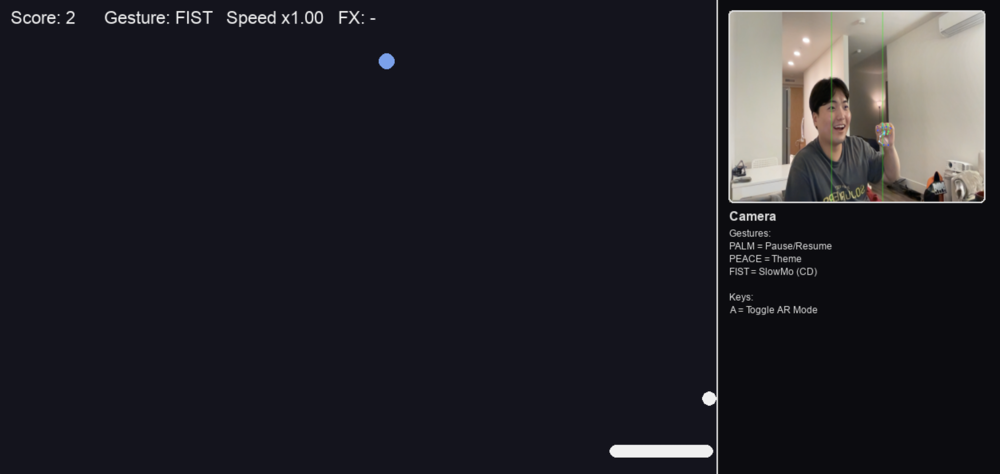

# 🕹️ GesturePong

A game that uses **gesture recognition** to play the classic Pong — with your hands!

---

## 🎮 Description

**GesturePong** is a Pong-inspired game built with **MediaPipe**, **OpenCV**, and **PyGame**, where players control the paddle and in-game actions through real-time hand gestures detected via webcam.

### ✋ Features
- **Gesture Mapping**
  - 🖐️ **PALM** → Pause / Resume game  
  - ✌️ **PEACE** → Switch color theme  
  - ✊ **FIST** → Activate slow-motion  
  - 🧤 Hand movement controls paddle position

- **Gameplay Mechanics**
  - 2D physics-based ball movement and collision detection  
  - Dynamic scoring and power-up effects  
  - Augmented Reality (AR) mode overlaying gameplay on live camera feed  

---

## ⚙️ Tech Stack
- **Languages:** Python  
- **Libraries:** MediaPipe, OpenCV, PyGame  
- **Concepts:** Real-time Computer Vision, Gesture Recognition, 2D Game Physics, AR Overlay
